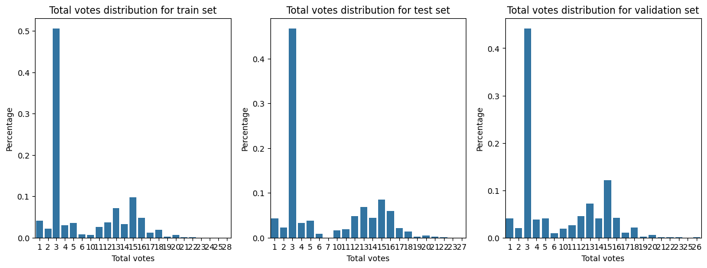
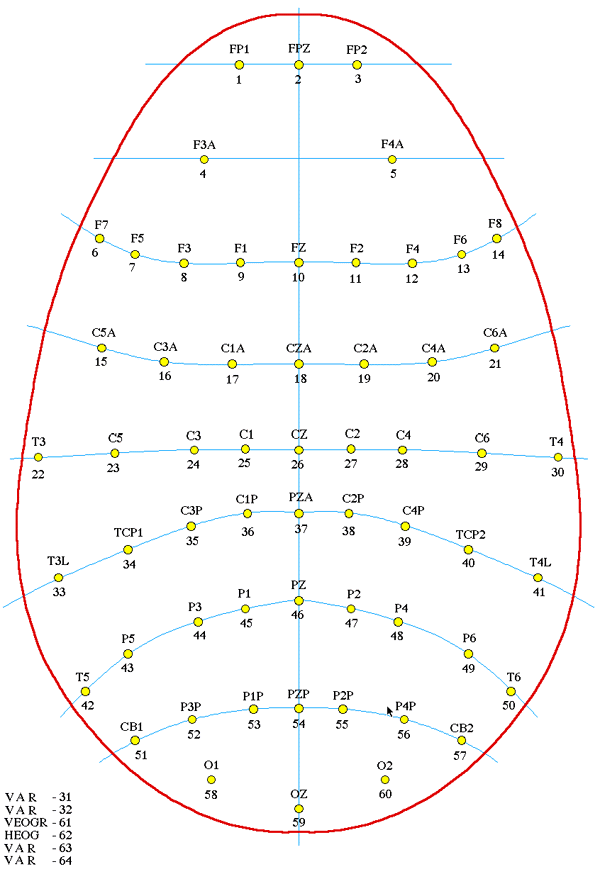

# eegClassification
Classification of EEG data based on the Kaggle competition [HMS - Harmful Brain Activity Classification
](https://www.kaggle.com/competitions/hms-harmful-brain-activity-classification/overview)

## Overview

There are six brain activity patterns of interest: seizure (SZ), generalized periodic discharges (GPD), lateralized periodic discharges (LPD), lateralized rhythmic delta activity (LRDA), generalized rhythmic delta activity (GRDA), or “other”.

The goal is to predict the probability of each of the six classes give 50-second window of EEG data and spectrogram data corresponding to 10 mins centered around the 50-second window.

One of the challenges is that the number of experts voting on each window varies. 

{width=5}
Fig: Distribution of the number of expert votes for the training, validation and test sets.

## Data

The data provided includes the raw EEG data and spectrograms. The EEG data records the electrical activity of the brain. The samples provided record a 50 second window, while the spectrograms cover a 10 minute window. 

The spectrograms are constructed from EEG data using [multitaper spectral estimation](https://en.wikipedia.org/wiki/Multitaper)[1], and represent a visualization of the Fourier spectrum of the EEG signals over time. 

The EEG data is collected using several electrodes and the four spectrograms are constructed from 4 different regions of the scalp as follows: Left lateral (Fp1, F7, T3, T5, O10); Right lateral (Fp2, F8, T4, T6, O2); Left Parasagittal (Fp1, F3, C3, P3, O1); Right Parasagittal (Fp2, F4, C4, P4, O2). 

{width=5}
Fig: EEG electrode placements[2]

## Contents

|Folder/File |Description|
|--|--|
|**`notebooks/`**|  Python notebooks. |
|`notebooks/first_look.ipynb`|  First look at the data. Creation of train, validation and test splits. |
|`notebooks/EDA_votes.ipynb`| Exploratory data analysis of the class distributions.  |
|`notebooks/Working_with_spectrograms.ipynb`|   |
|||
|**`files/`**| Folder containing output files. |
| `files/*_processed.csv`| Meta data corresponding to the train, validation and test splits created from training data. Some postprocessing is done, vote are converted to probabilities, total votes and file path to parquet files are recorded. |
|||
|**`sample_data/`**| Competition data, excluding full training data. |
| `sample_data/train_eegs` | One EEG from the training data form each class.  |
|||
|**`models/`** |Folder containing trained models. |

## Current tasks

- Explorator data analysis
	- labels distribution (expect consensus)
	- EEG data format
	- view spectrogram(s) (uniform size/missing data?)
		- spectrogram stacking possibilities
- Clarify goal (classify 50 second window or a whole EEG)  
- Understand Kullback-Leibler Divergence
	- Compute the KL score for a given annotator (if possible) 
- Create a Train/Validation/Test split with no data leakage (group by eeg_id) 
- Baseline model (random forest?)
- Make a first submission to leader board  
- Transfer learning (resnet50, imagenet, dino)  
	- Data preparation
	- Augmentation
	- Learning scheduler
- Explainablitiy

## Refereces

[1] Zafar, S.F., Amorim, E., Williamsom, C.A., Jing, J., Gilmore, E.J., Haider, H.A., Swisher, C., Struck, A., Rosenthal, E.S., Ng, M. and Schmitt, S., 2020. A standardized nomenclature for spectrogram EEG patterns: inter-rater agreement and correspondence with common intensive care unit EEG patterns. Clinical Neurophysiology, 131(9), pp.2298-2306.
[2] https://paulbourke.net/dataformats/eeg/